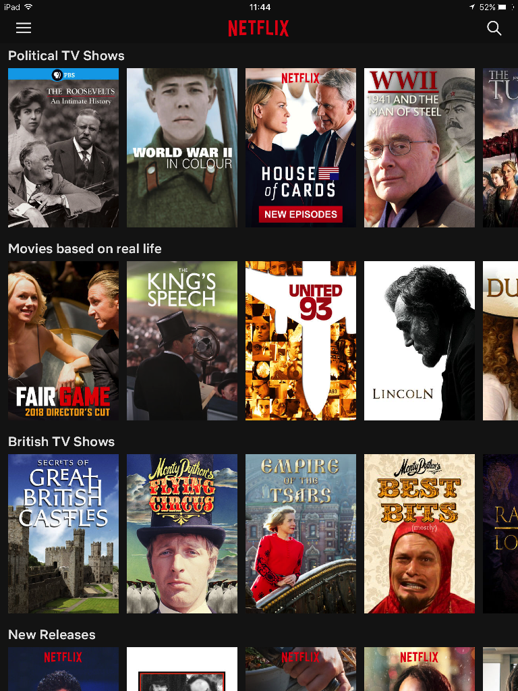
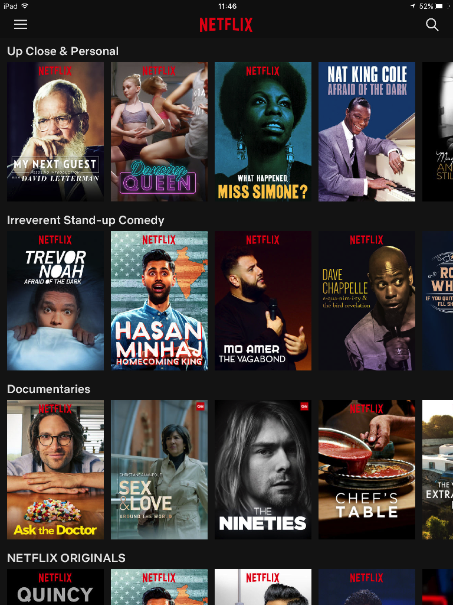
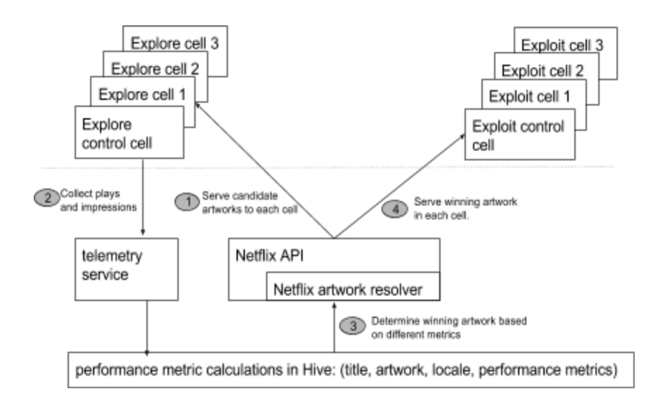

```{r setup, include=FALSE}
knitr::opts_chunk$set(echo = TRUE)
```

#Recommender Systems - Netflix vs. Amazon Prime

Both of these are the most popular sites for watching movies and more and more TV shows. Although the content in both sites overlaps, it is easy to see how the user experience is pretty different. 

###UX Design baseline

I started off by following the scenario design guideline given to better understand this difference:

**Netflix:**
Who are the target users?
Netflix subscribers who have already paid their monthly/yearly due to this service.
What are their goals?
Watch new and possible rare movies and series. 
How can you help them accomplish those goals?
Make recommendations not on what is popular, but on what best fits the taste of the user.

**Amazon:**
Who are the target users?
Amazon Prime subscribers who as part of a subscription to Amazon shopper's club receive this service.
What are their goals?
Find articles, products to buy on Amazon. These could include popular videos, TV series and other entertainment.
How can you help them accomplish those goals?
Show a personalized selection of the "best" products on the market.


###UX notable differences

As a user the first differences between these two site can be seen by simple launching them. In Netflix, each user creates a profile. At home all four of us have different profiles under the same account. FOr Amazon, we get one log in.

From here on both sites seem to be arranged similar. With rows of options under certain categories. But while in Amazon the categories seem to be driven by the videos in that category, on Netflix them seem more personal and change more often.

###Algorithm: Netflix

I found several articles explaining at a high level the algorithm used by Netflix. It is indeed a personalized algorithm in which user are categorized in groups. This suggest the use of some clustering. Users are then presented options for the group they belong to. The tags for each movie, used to place them in the different segments (runs the clustering) are manually defined by freelance manpower used by Netflix.

This means that when we open Netflix, each row presented to us is one of these groups of segments we belong to. Below is the screen for two accounts in my household.

The first screen is for my account. I would say the segments or rows chosen here for me are correct. I do watch political shows, movies based on real facts and British documentaries. But the movie selections themselves don't seem to be the best choice. It seems I've been tagged to the correct segments, but within the segment the individual selections are probably not the best.



The second screen shown is for my wife. First of all we can see the difference right away. Netflix is truly trying to personalize the service. But here, other than the first row, it doesn't seem to show the most relevant segments. My wife likes comedy, but not necessarily stand-ups, and she is really not into documentaries. But was is interesting, is that now the selections per row do seem to be the better choice. Documentaries, she would probably not pick one, but if she did, one of these might not be far off from her choice.



This example shows clearly the Netflix algorithm, its segmentation, and it does show what could be called marginal choice, allowing the user to explore at the edge of what is customary. That certainly fits the needs here, where the objective is to have the user stay interested in new programing. The goal here is for the user to have more and more selections to watch so that they keep on renewing the subscription month after month.

Amazon on the other hand as our scenario design analysis shows has different objectives. Here it is about "selling" you that next item. In Prime, many good movies require payment on top of the subscription. So now we don't get multiple profiles. The algorithm used is clearly driven by the product. Here each account shows based on its past history, similar items or selections with feature products, items. The goal here is not necessarily to explore new and unexpected movies and series, but rather guide us to the movie we just have to watch, but will now are to pay for once found.

###UX Art

Another interesting detail between these two sites is how they manage the artwork for each selection. Netflix has actually gone thru good research and is now using algorithms to change the artwork shown for each selection. So for a specific movie, instead of just showing the box office poster, they would change the image based on the users profile. So now that unexpected movie, with the tittle we do not recognize, might show us an image we are attracted to and lead us to click and watch it. They use classifiers with features than seem to be more user specific and less segment specific.



###Improvements

Clearly Netflix could use some improvements over its segmentation approach, at least as show by my personal recommendations shown on the platform. The segmentation approach seems sounds, as shown better by my wife's results, but maybe some refinement within the segment are in place. If my results for instance included some item classification within the segment, similar to Amazon's approach, that would probably show better results and I would spend more time watching Netflix. Debatable if that's good for me, but clearly what Netflix would like, I have in deed considered canceling the service before.


References

Recommendation algorithm
https://www.wired.co.uk/article/how-do-netflixs-algorithms-work-machine-learning-helps-to-predict-what-viewers-will-like


UX
https://uxplanet.org/netflix-binging-on-the-algorithm-a3a74a6c1f59
https://medium.com/netflix-techblog/selecting-the-best-artwork-for-videos-through-a-b-testing-f6155c4595f6


